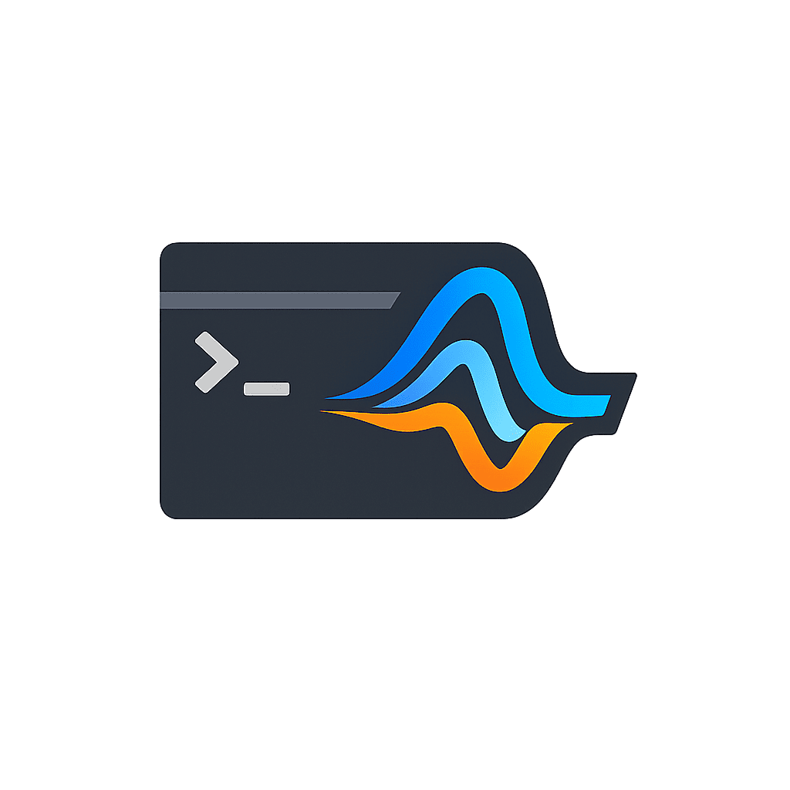

<p align="center">
  
  <h3 align="center"><a href="https://idelchi.github.io/aura">aura</a></h3>
  <p align="center">Agentic coding CLI</p>
</p>

---

[](https://github.com/idelchi/aura)
[](https://idelchi.github.io/aura)
[](https://pkg.go.dev/github.com/idelchi/aura)
[](https://goreportcard.com/report/github.com/idelchi/aura)
[](https://github.com/idelchi/aura/actions/workflows/github-actions.yml/badge.svg)
[](https://opensource.org/licenses/MIT)


> [!WARNING]
> This project was built with heavy use of [Claude Code](https://claude.ai/claude-code). The codebase is not indicative of the author's personal coding style.

`aura` is a terminal-based coding assistant that connects to local or remote LLMs.
Define agents, tools, modes, and guardrails as YAML and Markdown files.

## Highlights

**Task orchestration with assertions** — run multi-step workflows where the LLM builds, tests, and iterates until conditions pass:

```yaml
build-app:
  agent: high
  timeout: 60m
  commands:
    - /mode plan
    - Read SPEC.md and generate a plan.
    - /until not todo_empty "Create the plan with TodoCreate"
    - /mode edit
    - /auto on
    - Execute the plan.
    - /until bash:"go build ./..." "Build is failing. Fix the errors."
    - /until bash:"golangci-lint run" "Linting is failing. Fix the errors."
    - /export logs/result.log
```

**Condition gates** — `/assert` and `/until` evaluate shell commands, todo state, context usage, model capabilities, and more. The LLM keeps working until the condition is satisfied.

**Bash rewrite** — intercept every shell command through a Go template before execution. Wrap with tools like [rtk](https://github.com/ghostty-org/rtk), inject environment setup, or containerize execution:

**Config as code** — agents, modes, prompts, providers, hooks, and tasks are YAML and Markdown files. Git-trackable, mergeable, inheritable (DAG-based with cycle detection).

**Go plugins** — extend Aura with interpreted Go code: custom tools, slash commands, and lifecycle hooks (8 timings). Distributed via git, vendored dependencies, SDK version checking.

See the [examples and recipes](https://idelchi.github.io/aura/examples) for more patterns.

## Installation

```sh
curl -sSL https://raw.githubusercontent.com/idelchi/aura/refs/heads/dev/install.sh | sh -s -- -d ~/.local/bin
```

## Usage

```sh
# Initialize configuration
aura init

# Install recommended plugins
aura plugins add --subpath plugins/injectors, plugins/tools https://github.com/idelchi/aura

# Start interactive session
aura

# One-off prompt
aura run "explain this codebase"

# List available models
aura models
```

## Providers

| Provider   | Notes                                                    |
| ---------- | -------------------------------------------------------- |
| Ollama     | Local models, embedding, thinking, vision                |
| LlamaCPP   | Local llama.cpp server; also used for whisper and kokoro |
| OpenRouter | Cloud models, token auth                                 |
| OpenAI     | Any /v1/responses endpoint                               |
| Anthropic  | Claude models, thinking, vision                          |
| Google     | Gemini models, thinking, vision, embeddings              |
| Copilot    | GitHub Copilot subscription                              |
| Codex      | ChatGPT Plus/Pro subscription                            |

## Commands

```
aura              Interactive assistant (default)
aura run          Execute prompts non-interactively (inline or stdin)
aura mcp          List configured MCP servers and their tools
aura show         List and inspect config entities (agents, modes, prompts, providers, hooks, features, plugins, skills, tasks)
aura tasks        Manage and run scheduled tasks
aura models       List available models
aura tools        List, inspect, or execute tools
aura query        Embedding-based search across the codebase
aura vision       Analyze an image or PDF via a vision-capable LLM
aura transcribe   Transcribe an audio file to text
aura speak        Convert text to speech audio
aura tokens       Count tokens in a file or stdin
aura plugins      Manage plugins (add, remove, update)
aura skills       Manage skills (add, remove, update)
aura cache        Manage the cache (clean)
aura init         Initialize a default aura configuration
aura login        Authenticate with an OAuth provider (device code flow)
aura web          Start browser-based UI
```

## Configuration

Everything lives under `.aura/`:

```
.aura/
├── config/
│   ├── agents/       # Agent definitions (model, provider, prompt, tool filters)
│   ├── commands/     # Custom slash commands (Markdown + YAML frontmatter)
│   ├── features/     # Feature configs (compaction, thinking, tools, vision, stt, tts, embeddings, guardrail, estimation, subagent, plugins, mcp, sandbox, title)
│   ├── hooks/        # Shell hooks that run before/after tool execution
│   ├── lsp/          # Language server definitions for diagnostics
│   ├── modes/        # Mode definitions (tool availability, landlock restrictions, tool policy)
│   ├── mcp/          # MCP server definitions
│   ├── prompts/      # System prompts (referenced by agents)
│   ├── providers/    # Provider configs (ollama, llamacpp, openrouter, openai, anthropic, google, copilot, codex)
│   ├── rules/        # Persistent approval rules (created on-demand when approvals are saved)
│   ├── sandbox/      # Landlock restrictions
│   ├── tasks/        # Scheduled task definitions
│   └── tools/        # Optional tool text overrides (any tool type)
├── plugins/          # Go plugins (recursive discovery, organize into subdirs freely)
├── skills/           # LLM-invocable skills (Markdown + YAML frontmatter)
├── sessions/         # Saved sessions (JSON snapshots)
├── embeddings/       # Embeddings index (created on-demand when embeddings search is used)
├── cache/            # Cached data (catwalk metadata, model lists)
└── memory/           # Persistent key-value memory files
```

Run `aura init` to scaffold the default configuration. Every file is meant to be edited.
